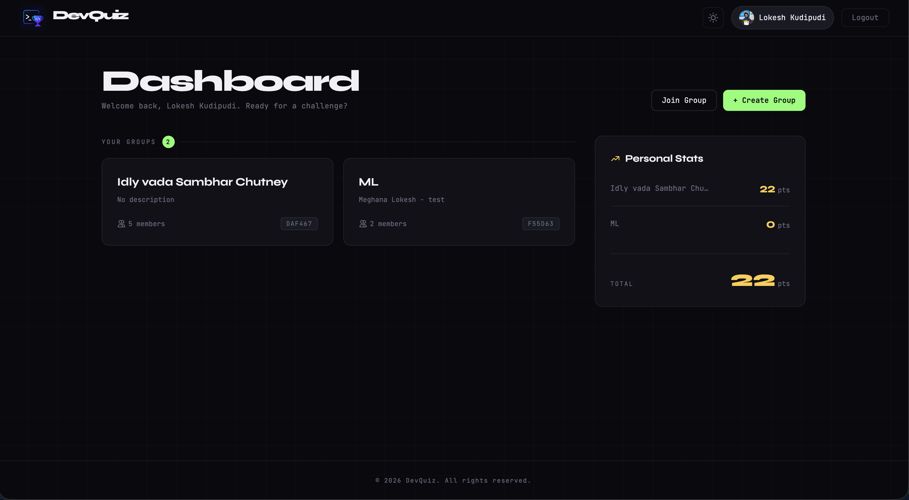
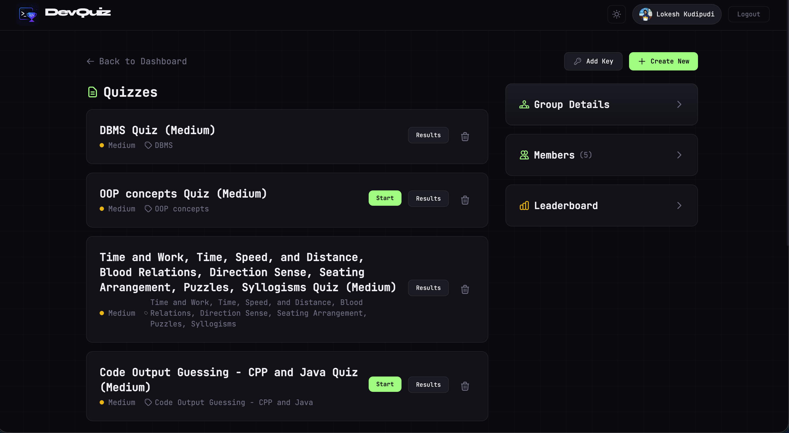
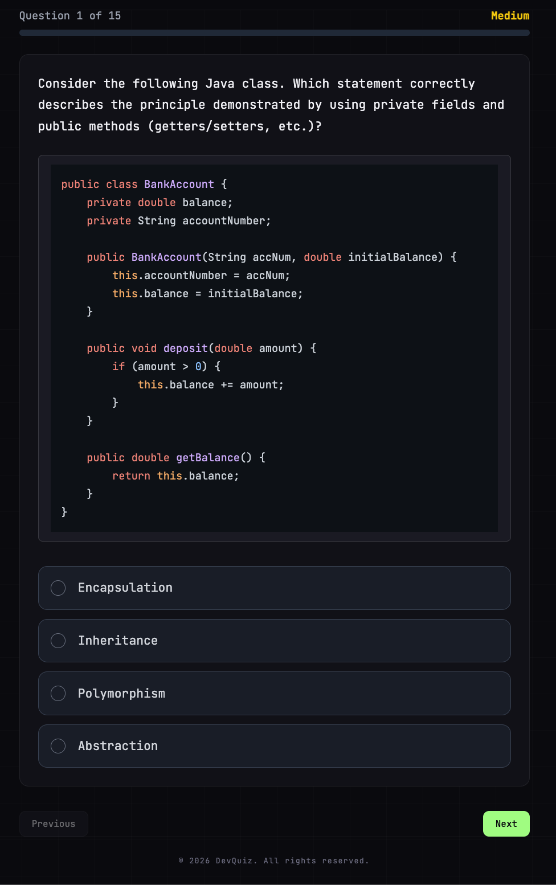
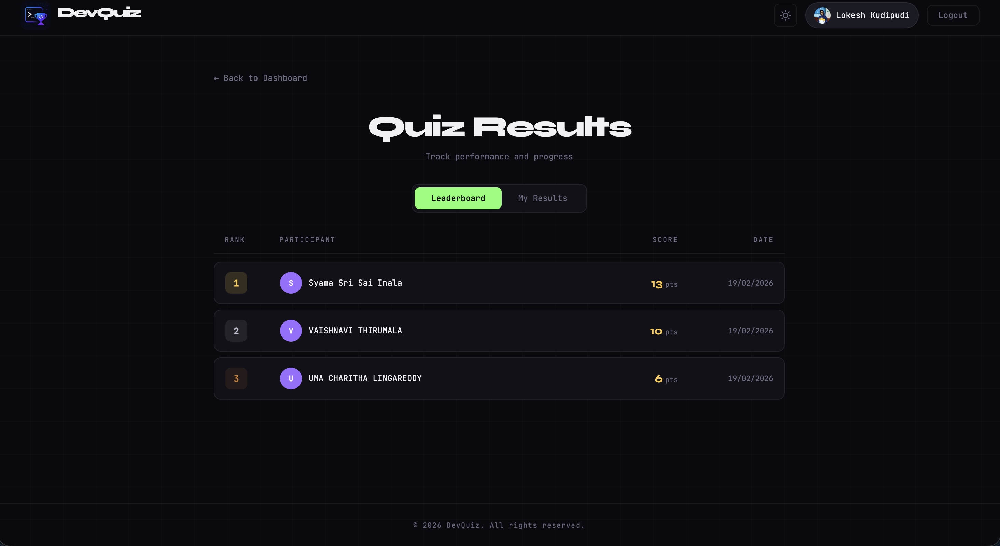
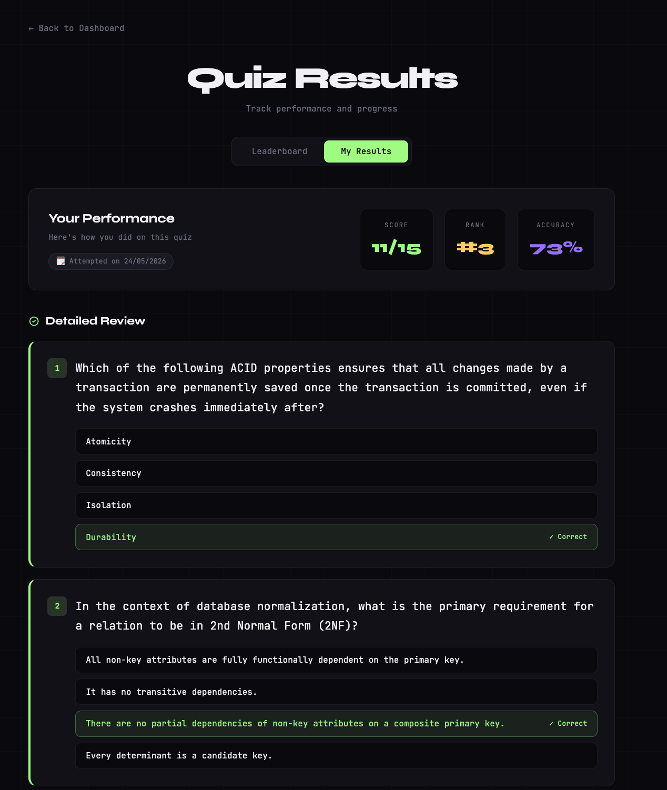
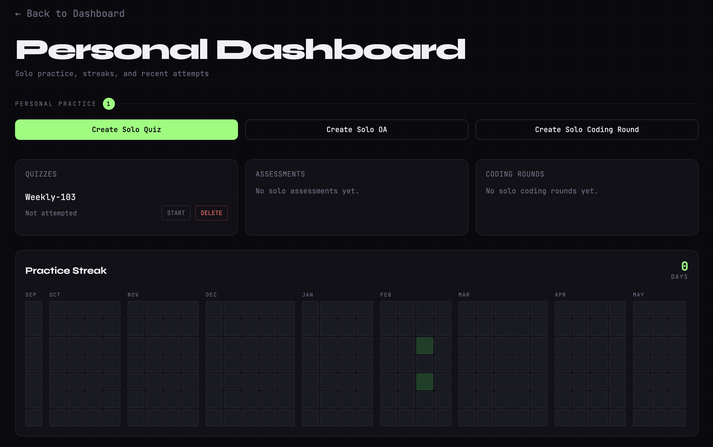

# DevQuiz

DevQuiz is a full-stack developer assessment platform with **group competition** and **solo practice** modes. It supports AI-generated quizzes, coding rounds, and online assessments with real-time updates and streak tracking.

## Highlights

- Dual mode experience:
  - Group mode for collaborative challenges and leaderboards
  - Solo mode with a dedicated Personal Dashboard
- AI content generation using Gemini for:
  - Quizzes
  - Coding question sets
  - Multi-section online assessments
- Real-time round lifecycle with Socket.io (lobby/live/results)
- Attempt tracking and performance views (Start/Results, per-item actions)
- UTC-based practice streak heatmap across solo quiz/OA/coding activity

## Tech Stack

- Frontend: React 19, Vite, Tailwind CSS, React Router, Socket.io client
- Backend: Node.js, Express, Socket.io, Passport (Google OAuth), JWT + HTTP-only cookies
- Database: MongoDB + Mongoose
- AI: Gemini API
- Tooling: ESLint, Nodemon

## Current Scope

- Authentication
  - Google OAuth
  - Email/password auth
  - Demo login
- Groups
  - Create/join groups via invite code
  - Group details with content management
- Quizzes
  - Generate via AI
  - Attempt + scoring + results views
  - Solo + group access control
- Online Assessments
  - Multi-section timed assessments
  - Start/submit-section/end flows
  - Results + leaderboard
  - Solo + group access control
- Coding Rounds
  - Group and solo round creation
  - External round lifecycle (lobby/live/results)
  - Optional question generation and catalog-topic filtering
- Personal Dashboard
  - Solo quick-create actions
  - Start/Results/Delete actions for solo items
  - Practice streak heatmap

## Screenshots








## Repository Metrics

- 46 API route handlers across auth/group/solo/quiz/OA/coding/leaderboard
- 15 frontend pages
- 6 Mongoose models
- 6 backend controllers

## Quick Setup

1. Clone the repository.
2. Install backend dependencies:
   ```bash
   cd backend
   npm install
   ```
3. Install frontend dependencies:
   ```bash
   cd frontend
   npm install
   ```
4. Configure environment files:
   - Copy `backend/.env.example` -> `backend/.env`
   - Copy `frontend/.env.example` -> `frontend/.env`
5. Start services:
   - Backend: `npm run dev` (inside `backend`)
   - Frontend: `npm run dev` (inside `frontend`)

Default ports: frontend `5173`, backend `5174`.
